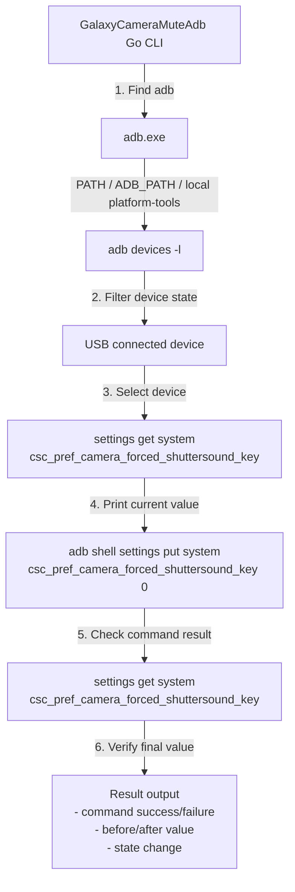
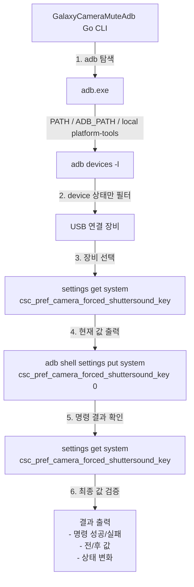

# GalaxyCameraMuteAdb

<details open>
<summary><strong>English</strong></summary>

GalaxyCameraMuteAdb is a small Go CLI that lists USB-connected Android devices and sends only this ADB command to the selected device:

```bash
adb shell settings put system csc_pref_camera_forced_shuttersound_key 0
```

At runtime, the tool applies the command to the selected device by using `-s <serial>`.

## Requirements

- Go 1.25+
- Android Platform Tools
- USB debugging enabled on the phone

ADB lookup order:

1. `adb` from PATH
2. `ADB_PATH` environment variable
3. `platform-tools\adb.exe` inside the project folder
4. Common Windows Android SDK locations
5. If still not found, automatically download and extract Platform Tools into `platform-tools\`

Official pages:

```text
https://developer.android.com/tools/releases/platform-tools
```

Direct Windows ZIP used by the app for auto-download:

```text
https://dl.google.com/android/repository/platform-tools-latest-windows.zip
```

## Run

Windows:

```bat
run.cmd
```

Linux / macOS:

```sh
sh ./run.sh
```

You can also run directly:

```bash
go run .
```

The current version is read from the root `VERSION` file and shown at startup.

Flow:

1. Run `adb devices -l`
2. Keep only devices in `device` state
3. Let the user choose a device
4. Read the current setting value
5. Send the `settings put` command
6. Read the setting again and print success/failure

Patch flow:



You can also place ADB directly in the project folder:

```text
platform-tools\adb.exe
```

If `adb` is missing, the app can automatically:

1. Download the official Windows Platform Tools ZIP
2. Extract it into `platform-tools\`
3. Run `platform-tools\adb.exe`

If auto-download fails because of network or policy restrictions, manual download is still possible from the official page above.

## Build

Windows:

```bat
build.cmd
```

Linux / macOS:

```sh
sh ./build.sh
```

The build scripts create the `release` folder and output a versioned binary like this:

```text
release\GalaxyCameraMuteAdb_v0.1.0.exe
release/GalaxyCameraMuteAdb_v0.1.0_linux
release/GalaxyCameraMuteAdb_v0.1.0_macos
```

## Release

Windows:

```bat
release.cmd
```

Linux / macOS:

```sh
sh ./release.sh
```

Release flow:

1. Remove existing files in the `release` folder
2. Build a fresh executable with `build.cmd`
3. Stage all changes with `git add -A`
4. Commit with message `release: v<version>`
5. Push the current branch to `origin`
6. Create the version tag if missing, or force-update it to current `HEAD`
7. Generate release notes from the previous tag to the current commit
8. Create or update the GitHub Release
9. Upload `release\GalaxyCameraMuteAdb_v<version>.exe`

Local dry run without remote publish:

```bat
release.cmd -SkipPublish
```

```sh
sh ./release.sh -SkipPublish
```

## Notes

- If `adb` is not found, the app tries to auto-download official Platform Tools first.
- If auto-download fails, the app prints the manual download page.
- Devices in `offline` or `unauthorized` state are not selectable.
- If no usable device is found, the app prints guidance for Developer Mode and USB debugging.

</details>

<details>
<summary><strong>한국어</strong></summary>

GalaxyCameraMuteAdb는 USB로 연결된 Android 장비를 조회하고, 선택한 장비에 아래 ADB 명령만 실행하는 간단한 Go CLI입니다.

```bash
adb shell settings put system csc_pref_camera_forced_shuttersound_key 0
```

실행 시에는 `-s <serial>` 옵션을 사용해서 선택한 장비에만 적용합니다.

## 요구 사항

- Go 1.25+
- Android Platform Tools
- 휴대폰에서 USB 디버깅 활성화

ADB 탐색 순서:

1. PATH의 `adb`
2. `ADB_PATH` 환경변수
3. 프로젝트 폴더 내부 `platform-tools\adb.exe`
4. Windows의 일반적인 Android SDK 경로
5. 그래도 없으면 공식 Platform Tools를 자동 다운로드해서 `platform-tools\`에 압축 해제

공식 페이지:

```text
https://developer.android.com/tools/releases/platform-tools
```

앱이 자동 다운로드에 사용하는 Windows ZIP 직접 링크:

```text
https://dl.google.com/android/repository/platform-tools-latest-windows.zip
```

## 실행

Windows:

```bat
run.cmd
```

Linux / macOS:

```sh
sh ./run.sh
```

또는 직접:

```bash
go run .
```

현재 버전은 루트의 `VERSION` 파일에서 읽어 시작 시 출력합니다.

동작 흐름:

1. `adb devices -l` 실행
2. `device` 상태 장비만 필터링
3. 사용자에게 장비 선택 받음
4. 현재 설정값 조회
5. `settings put` 명령 전송
6. 다시 설정값을 읽어 성공/실패 출력

패치 구조:



프로젝트 폴더에 ADB를 직접 둘 수도 있습니다.

```text
platform-tools\adb.exe
```

`adb`가 없으면 앱이 자동으로 다음 단계를 수행할 수 있습니다.

1. 공식 Windows Platform Tools ZIP 다운로드
2. `platform-tools\` 폴더로 압축 해제
3. `platform-tools\adb.exe` 실행

네트워크나 정책 제한으로 자동 다운로드가 실패하면, 위 공식 페이지에서 수동 다운로드할 수 있습니다.

## 빌드

Windows:

```bat
build.cmd
```

Linux / macOS:

```sh
sh ./build.sh
```

빌드 스크립트는 `release` 폴더를 만들고, 아래처럼 버전이 포함된 실행 파일을 생성합니다.

```text
release\GalaxyCameraMuteAdb_v0.1.0.exe
release/GalaxyCameraMuteAdb_v0.1.0_linux
release/GalaxyCameraMuteAdb_v0.1.0_macos
```

## 릴리즈

Windows:

```bat
release.cmd
```

Linux / macOS:

```sh
sh ./release.sh
```

릴리즈 흐름:

1. `release` 폴더의 기존 파일 삭제
2. `build.cmd`로 새 실행 파일 빌드
3. 변경 파일 전체를 `git add -A`
4. `release: v<version>` 메시지로 커밋
5. 현재 브랜치를 `origin`에 푸시
6. 버전 태그가 없으면 생성하고, 있으면 현재 `HEAD`로 강제 업데이트
7. 이전 태그부터 현재 커밋까지 릴리즈 노트 생성
8. GitHub Release 생성 또는 업데이트
9. `release\GalaxyCameraMuteAdb_v<version>.exe` 업로드

원격 반영 없이 로컬에서만 확인하려면:

```bat
release.cmd -SkipPublish
```

```sh
sh ./release.sh -SkipPublish
```

## 참고

- `adb`를 찾지 못하면 먼저 공식 Platform Tools 자동 다운로드를 시도합니다.
- 자동 다운로드가 실패하면 수동 다운로드 페이지를 안내합니다.
- `offline`, `unauthorized` 상태 장비는 선택 목록에서 제외됩니다.
- 사용 가능한 장비가 없으면 개발자 모드와 USB 디버깅 확인 안내를 출력합니다.

</details>
