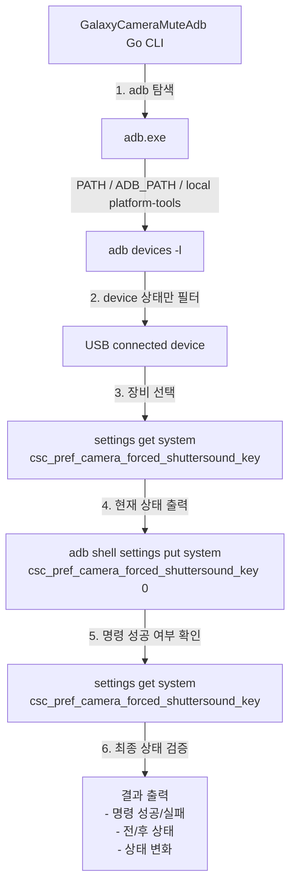

# GalaxyCameraMuteAdb

유선으로 연결된 Android 장비를 조회하고, 선택한 장비에 아래 ADB 명령만 실행하는 간단한 Go CLI입니다.

```bash
adb shell settings put system csc_pref_camera_forced_shuttersound_key 0
```

실제 실행 시에는 선택한 장비에만 적용되도록 `-s <serial>` 옵션을 붙여 실행합니다.

## 요구 사항

- Go 1.25+
- Android Platform Tools
- USB 디버깅이 허용된 장비

`adb` 탐색 순서:

1. PATH 의 `adb`
2. `ADB_PATH` 환경변수
3. 프로젝트 폴더의 `platform-tools\adb.exe`
4. Windows의 일반적인 Android SDK 경로

없으면 아래 공식 페이지에서 받을 수 있습니다.

```text
https://developer.android.com/tools/releases/platform-tools
```

## 실행

```bash
go run .
```

또는 스크립트:

```bat
run.cmd
```

실행 시 현재 버전이 함께 출력됩니다. 버전은 프로젝트 루트의 `VERSION` 파일로 관리합니다.

흐름:

1. `adb devices -l` 로 연결된 장비 목록 조회
2. `device` 상태인 장비만 표시
3. 콘솔에서 번호 선택
4. 선택한 장비에 셔터음 비활성화 명령 실행

패치 구조:



프로젝트 폴더에 직접 둘 수도 있습니다.

```text
platform-tools\adb.exe
```

## 빌드

```bash
build.cmd
```

또는 스크립트:

```bat
build.cmd
```

`build.cmd` 는 `release` 폴더를 만들고, `VERSION` 파일 값을 읽어 아래 형태로 실행 파일을 생성합니다.

```text
release\GalaxyCameraMuteAdb_v0.1.0.exe
```

## 릴리즈

```bat
release.cmd
```

동작:

1. `VERSION` 파일 기준으로 `v<version>` 태그 확인
2. 태그가 없으면 생성, 있으면 현재 `HEAD` 로 강제 업데이트
3. 이전 태그와 현재 커밋 사이의 로그로 릴리즈 메시지 생성
4. `build.cmd` 로 빌드
5. GitHub Release 생성 또는 업데이트
6. `release\GalaxyCameraMuteAdb_v<version>.exe` 업로드

원격 반영 없이 로컬에서만 확인하려면:

```bat
release.cmd -SkipPublish
```

## 참고

- `adb` 를 찾지 못하면 다운로드 경로와 함께 안내를 출력합니다.
- 장비가 `offline`, `unauthorized` 상태면 목록에서 제외됩니다.
